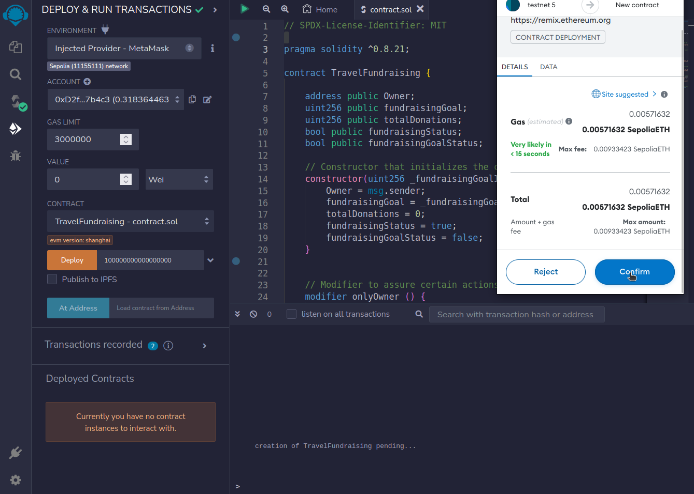
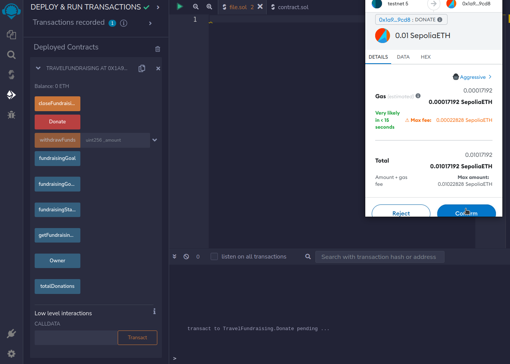
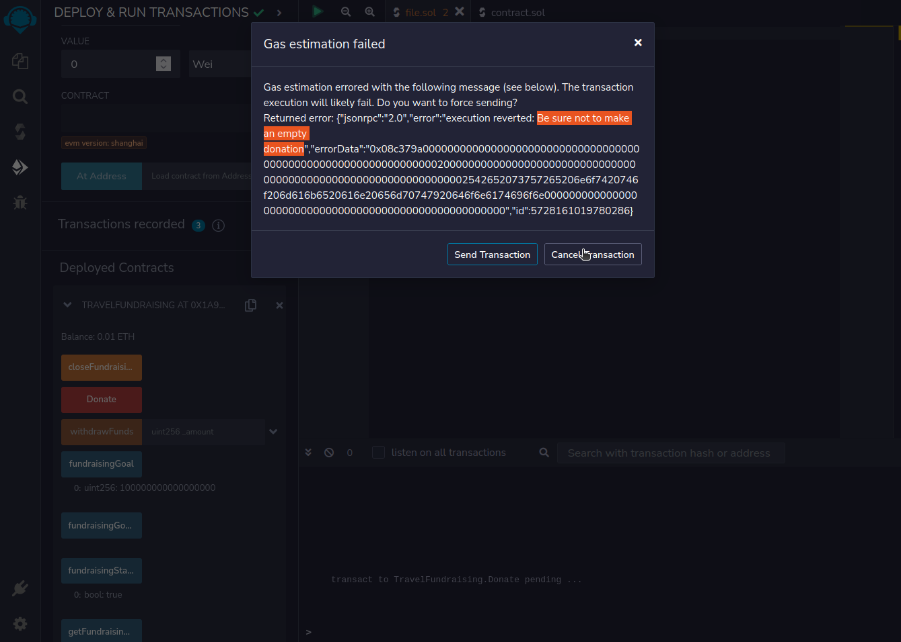

# Start2Impact Blockchain Intro Project

    

This is my Blockchain Intro project for [Start2Impact](https://talent.start2impact.it/profile/riccardo-santi).

### TravelFundraising: A Smart Contract to raise funds for a travel company through the Ethereum blockchain.

TravelFundraising is a Smart Contract coded in Solidity and carefully tested using Remix IDE.
Through TravelFundraising, campaign organizers can start a fundraising and set the Ether target at the beginning, ensuring complete transparency and control.
Users can make contributions of any amount, track the contract's balance in real-time, and have confidence in the security and immutability of the blockchain. When the fundraising target is reached, the owner can instantly close the campaign and withdraw the collected Ether. This innovative approach simplifies the fundraising process and also guarantees the integrity of funds management, promoting transparency and reliability.

**Solidity** is a programming language for creating smart contracts on the Ethereum blockchain.
 
**Remix IDE** is a powerful integrated development environment for building, testing, and deploying Ethereum smart contracts.

## 📖Index

- [ 🚀 Main Features (Tech Explanation) ](#mainfeatures)
- [ 🛠️ How to deploy ](#howtodeploy)
- [ 📈 Improved Skills ](#improvedskills)
- [ 👨‍💻 About me ](#aboutme)

## 🚀 Main Features:

- #### The campaign organizer sets the fundraising target in Wei (an Ether submultiple) and starts the campaign by deploying the contract to the blockchain, in this example the target is set to 0.1 Ether (100000000000000000 Wei)

    

  

    

  

    

  

- #### Users can send funds to the contract through the Donate function, in this example we are donating 0.01 Ether

    

  

    

  

- #### Everyone can see the the number of donations, the fundraising goal and the status (open: still accepting donations - closed: target reached, no longer accepting donations)

    

  

    

  

    

  

- #### Users can also see the contract's balance in real-time through the getFundraisingBalance function

    

  

- #### Once the goal is reached the Owner can close the campaign through the closeFundraising function and withdraw Ether through the withdrawFunds function

    

  

    

  

    

  

    

  

    

  

    

  

- #### Many prior checks are implemented to assure complete security: for example only the Owner can close the fundraising and collect the funds

    

  

    

  

- #### Another example is that you get a warning if you try to make an empty donation

    

  

    

  

## 🛠️ How to deploy

- Clone this repository in your local
- Open [Remix IDE](https://remix.ethereum.org/) in your browser and upload the `contract.sol` file in a new workspace.
- Open the Compiler section, select `Solidity version 0.8.21` and click Compile.
- Be sure to have [Metamask wallet](https://metamask.io/download/) installed and with some Ether on the testnet.
- Open the Deploy & Run section, select `Injected Provider - Metamask` and approve the connection.
- Next to the orange Deploy button type the desider fundraising target in Wei (here's a conversion tool) and click Deploy.
- Now the contract is deployed on the blockchain so you can enojy its features through the Deployed Contracts section in the bottom of the page!

## 📈 Improved Skills

[Solidity](https://soliditylang.org/), [Remix IDE](https://remix-ide.readthedocs.io/en/latest/)

## 👨‍💻 About me

 &nbsp;&nbsp;

